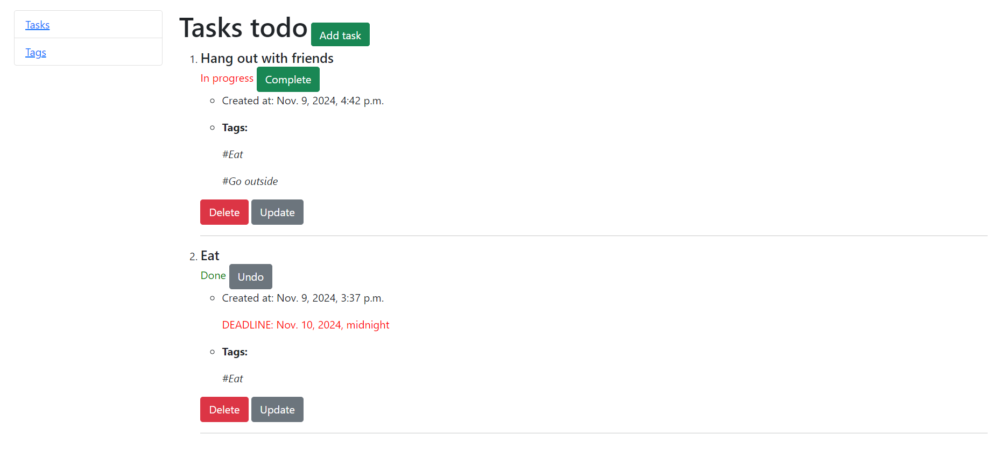
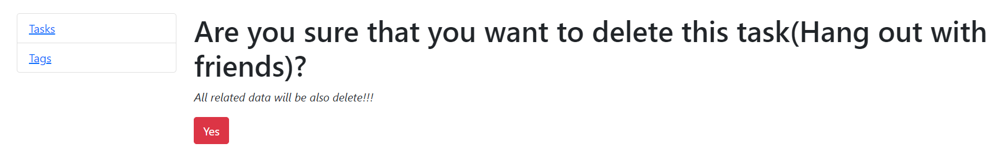
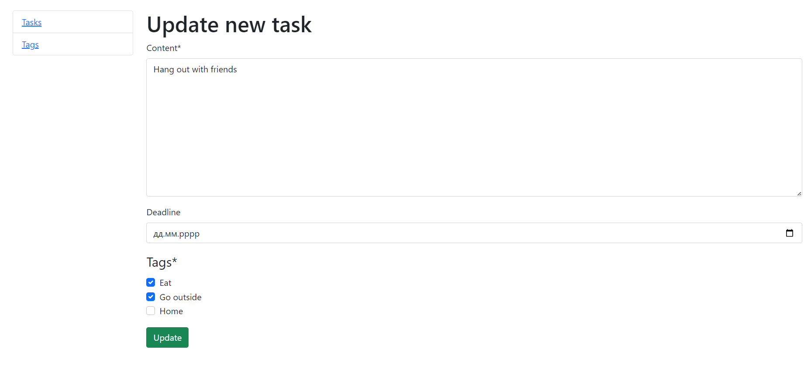
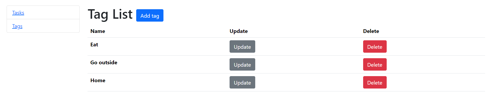
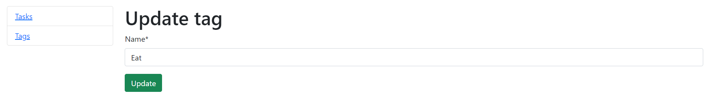
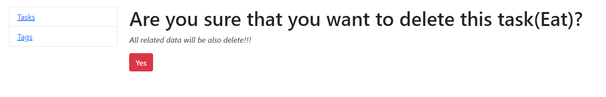

"# Todo-list"

Set Up for `Windows` 

> Install modules via `VENV` (windows) 

```
$ virtualenv env
$ .\env\Scripts\activate
$ pip install -r requirements.txt
```

<br />

> Set Up Database

```bash
$ python manage.py makemigrations
$ python manage.py migrate
$ python manage.py loaddata dump.json
```

<br />

> Start the app

```bash
$ python manage.py runserver
```

At this point, the app runs at `http://127.0.0.1:8000/`. 

<br />

Task List page:


Task Delete page:


Task Update/Create page:


Tag list page:


Tag update page:


Tag delete page:
